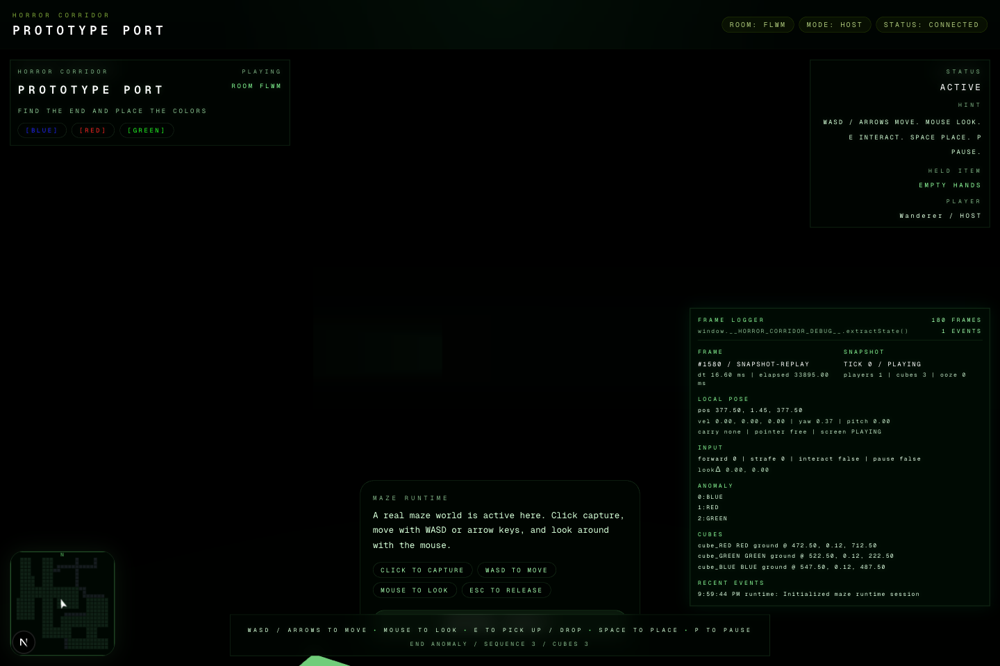
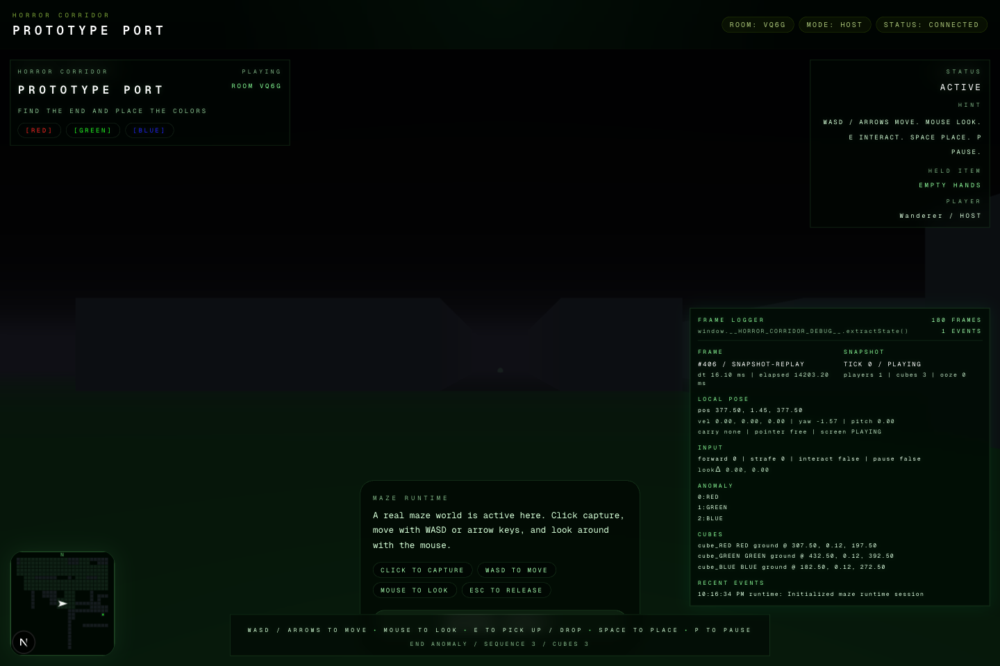

# HorrorCorridor V1 Black Viewport Audit

## Scope

- Date: 2026-03-23
- Goal: audit why the `PLAYING` view looked fully black, verify the actual signal flow, implement the render-side fix, and preserve the findings in `docs/`.

## Symptom

- Detached browser validation on `http://127.0.0.1:3006/?debug=frames` reached `PLAYING`, but the main world read as almost entirely black.
- The HUD, minimap, and frame logger were visible, which suggested the issue was not a full app freeze or overlay-only failure.

## Signal-Flow Checks

### Renderer mounted

- Confirmed.
- Detached Playwright `page.evaluate(...)` returned a live canvas with:
  - `width: 1439`
  - `height: 888`
  - `clientWidth: 1600`
  - `clientHeight: 987`
- `GameCanvas.tsx` appends `renderer.domElement` to the mount and removes it during cleanup.

### Scene attached

- Confirmed.
- `GameCanvas.tsx` still calls `world.attach(scene)` before starting the animation loop.
- `renderer.render(scene, camera)` remains on every runtime loop branch.

### Camera updated

- Confirmed.
- The frame logger showed live pose values in `PLAYING`:
  - local position `377.5, 1.45, 377.5`
  - yaw `-1.5707963267948966`
- `syncCameraFromPlayer(...)` still applies the local pose and view angles before each render.

### Frame loop alive

- Confirmed.
- `window.__HORROR_CORRIDOR_DEBUG__.extractState()` returned a live advancing frame counter.
- Detached Playwright showed the logger advancing into `snapshot-replay` frames with no runtime crash.

### Lighting present but insufficient / mispositioned

- Confirmed root cause.
- Before the fix, `createLights.ts` created non-ambient corridor point lights near world origin:
  - `(0, 2.7, 2.4)`
  - `(0, 2.65, -7.5)`
  - `(0, 2.7, -24)`
  - `(0, 0.9, -10)`
- The actual maze/player in the tested run lived around `x/z ~= 377.5`, so those lights did not illuminate the local corridor.
- The prototype’s player-follow light was also missing, which starved the first-person view of local illumination.

### Spawn yaw parity drift

- Confirmed root cause.
- `createInitialGameState.ts` previously aimed the local player from the start cell toward the end cell instead of using the prototype spawn angle `-Math.PI / 2`.
- That could point the first frame into nearby wall geometry and make the dark scene read as completely black.

## Fixes Implemented

### Spawn yaw

- Restored prototype spawn yaw in [createInitialGameState.ts](/Users/crimsonwheeler/Documents/GitHub/HorrorCorridor/HorrorCorridor-V1/src/features/game-state/domain/createInitialGameState.ts).
- The local player now starts at `-Math.PI / 2`.

### Lighting ownership

- Removed the origin-centered point-light rig from [createLights.ts](/Users/crimsonwheeler/Documents/GitHub/HorrorCorridor/HorrorCorridor-V1/src/features/render/three/createLights.ts).
- Kept `createLights.ts` focused on ambient + hemisphere contribution.
- Added a player-follow light in [worldBuilder.ts](/Users/crimsonwheeler/Documents/GitHub/HorrorCorridor/HorrorCorridor-V1/src/features/render/three/worldBuilder.ts).
- Extended `MazeWorldFrame` so `GameCanvas.tsx` passes `localPlayerPosition` into the world update, allowing the render layer to own the player light.

### Material response

- Switched static lit materials in [createMaterials.ts](/Users/crimsonwheeler/Documents/GitHub/HorrorCorridor/HorrorCorridor-V1/src/features/render/three/createMaterials.ts) from `MeshStandardMaterial` to `MeshLambertMaterial`.
- Retuned the palette toward the prototype:
  - main floor `0x183020`
  - branch floor `0x1A1A20`
  - wall `0x2A2A35`
  - ceiling `0x0A0A0E`
  - pedestal `0x333340`

### Renderer / scene output

- Removed ACES filmic tone mapping in [createRenderer.ts](/Users/crimsonwheeler/Documents/GitHub/HorrorCorridor/HorrorCorridor-V1/src/features/render/three/createRenderer.ts) and switched to `NoToneMapping`.
- Retuned clear color in the renderer and the scene background/fog in [createScene.ts](/Users/crimsonwheeler/Documents/GitHub/HorrorCorridor/HorrorCorridor-V1/src/features/render/three/createScene.ts) closer to the prototype’s dark blue-black.

## Browser Evidence

### Before

- The world was technically rendering, but luminance was crushed so far down that the viewport read as effectively black.

### After

- The default `PLAYING` view is now visibly readable before pointer lock.
- The floor is visibly green-lit.
- Wall silhouettes and corridor depth are visible.
- The view is no longer mistaken for a missing camera or missing renderer mount.

## Validation Evidence

- `npx tsc --noEmit` passed.
- `npm run lint` passed.
- Detached Playwright validated:
  - `START -> LOBBY_HOST -> PLAYING`
  - live frame logger present
  - live canvas mounted and non-zero sized
  - no console errors beyond normal dev/HMR logs
  - visible corridor geometry before pointer lock
- `window.__HORROR_CORRIDOR_DEBUG__.extractState()` returned:
  - `enabled: true`
  - `overlayVisible: true`
  - `latestMode: "snapshot-replay"`
  - `latestYaw: -1.5707963267948966`
  - `latestPosition: { x: 377.5, y: 1.45, z: 377.5 }`

## Conclusion

- The black viewport was a render-visibility regression, not a missing mount or dead camera.
- The primary causes were mispositioned origin-centered lights, missing player-follow illumination, overly dark material/output choices, and non-prototype spawn yaw.
- The current runtime is visibly readable again and closer to the one-file prototype’s first-person corridor view.

## Remaining Caveats

- Detached Playwright still cannot provide a full pointer-lock human play session here, so live movement/look readability under active pointer lock remains better suited to a manual pass.
- The current fix restores visibility and prototype direction; it does not attempt a broader render architecture rewrite.
